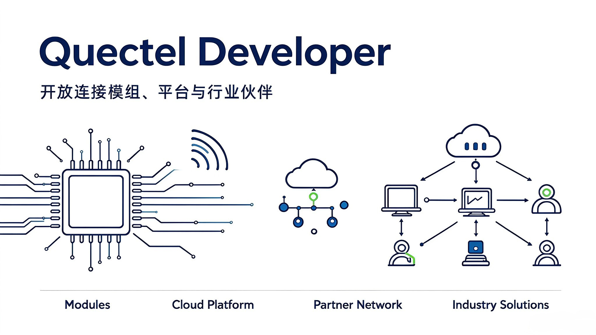

# 欢迎来到移远通信 GitHub 主页

移远通信所有面向 **蜂窝、智能、短距离、GNSS 以及 AIoT 模块** 的官方软件、软件开发工具包、演示项目与工具链，均托管于该 GitHub 组织下。

 

 

 

## 快速上手

如需开始使用移远物联网解决方案，请访问[移远官网](https://www.quectel.com.cn/)。开发者门户提供方案专题文章、产品发布公告、版本说明、技术工坊资料以及活动资讯。

您也可查阅官方文档：

- 📖 [Quectel Pi 文档中心 ](https://www.quectel.com.cn/quectel‑pi/documentation-center)
- 📖 [QuecPython 文档中心 ](https://www.quectel.com.cn/quecpython/document_center)
- 📖 [开发板与硬件 ](https://www.quectel.com.cn/devboard_and_hardware)
- 📖 [下载专区](https://www.quectel.com.cn/download‑zone)

如遇到技术问题，请访问 💬[官方开发者社区](https://forumschinese.quectel.com/)。

## 核心开发框架

移远核心开发框架为基于移远蜂窝模组 / 智能模组开发应用提供底层支撑，支持 C/C++ 以及 Python 开发。

| 框架                                          | 简介                                               | 入口                                                         |
| --------------------------------------------- | -------------------------------------------------- | ------------------------------------------------------------ |
| **QuecPython** *Python IoT Framework*     | 面向蜂窝模组的 Python 开发框架，快速构建物联网应用 |  |
| **UniKnect** *MCU‑Module Interaction SDK* | MCU 与蜂窝模组交互 SDK，打通主控与通信能力         |  |
| **UniRTOS** *UniRTOS SDK*                 | 统一实时操作系统 SDK，支撑高性能智能模组开发       |  |

## VSCode 插件

官方 VSCode 插件，提供工程模板、调试支持，提升开发效率。

| 插件                              | 描述                        | 仓库链接                                                     |
| --------------------------------- | --------------------------- | ------------------------------------------------------------ |
| **qpy-vscode-extension-doc**      | QuecPython 官方 VSCode 扩展 |  |
| **qpi-vscode-extension-doc**      | Quectel Pi 官方 VSCode 扩展 |  |
| **unirtos-vscode-extension-doc**  | UniRTOS 官方 VSCode 扩展    |  |
| **uniknect-vscode-extension-doc** | UniKnect 官方 VSCode 扩展   |  |

# 产品线

## 智慧物联网

| 仓库/组织                                   | 描述                                                         | 开发语言 |
| ------------------------------------------- | ------------------------------------------------------------ | -------- |
| [Quectel Pi](https://github.com/quectel-pi) | Quectel Pi 提供搭载全套软件的智能控制板，面向高性能、低功耗物联网与边缘计算嵌入式解决方案。 | Python/C |

##  无线短距离

>  Wi‑Fi / BLE

欢迎访问：[移远短距离通信文档中心](https://developer.quectel.com/doc/shortrange/zh/index.html) 

##  物联网云平台

> 艾络迅™飞鸢物联网平台一站式接入，快速实现您的智能互联之旅

欢迎访问：[艾络迅 - 科技连接未来](https://aiot.quectel.com/) 

## 更多

如需进一步了解我们的开发框架、解决方案与代码库，请前往项目页面查看各项目简要说明。 

🏢  如需了解移远通信的全系列产品与服务，请访问我们的官方网站：https://www.quectel.com.cn/。 

